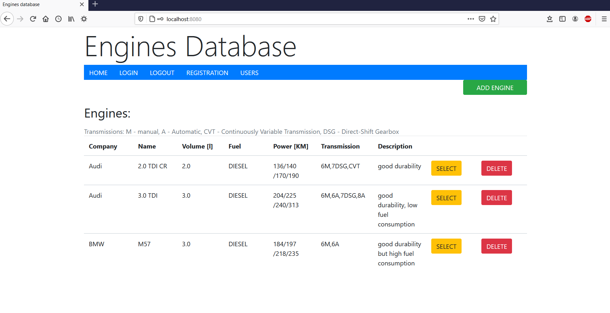
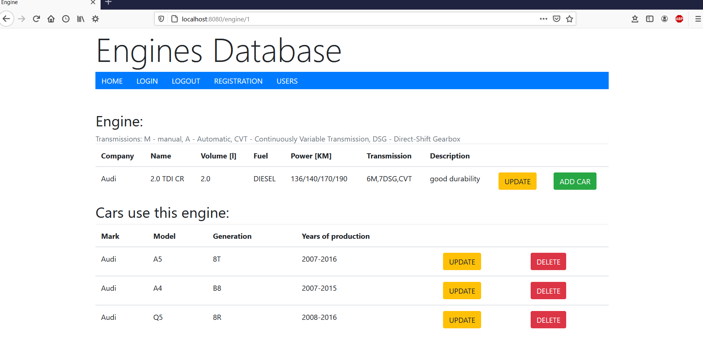
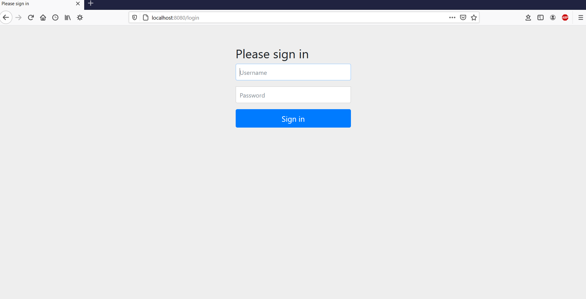
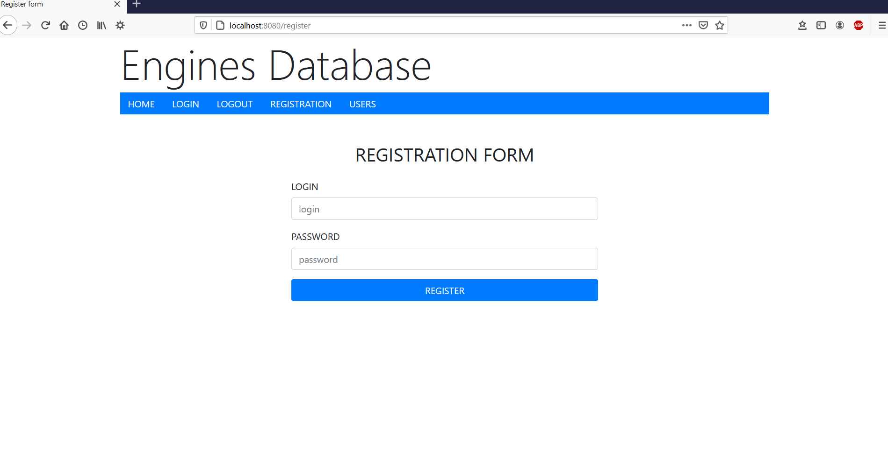
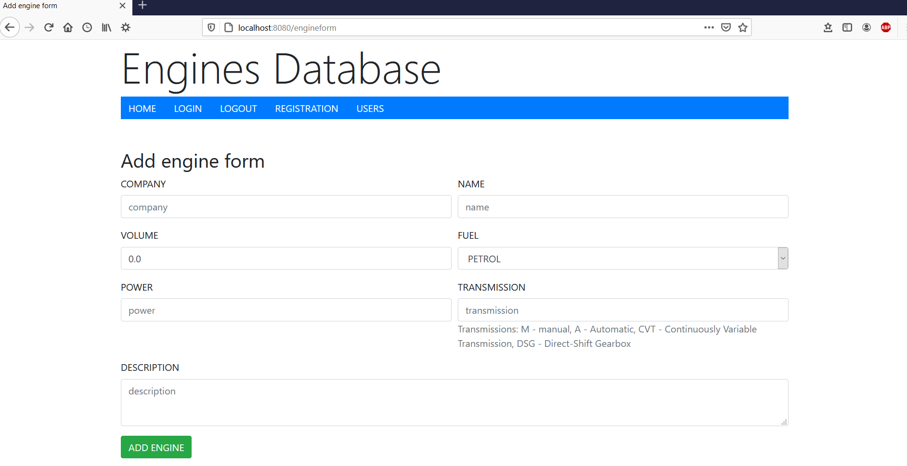
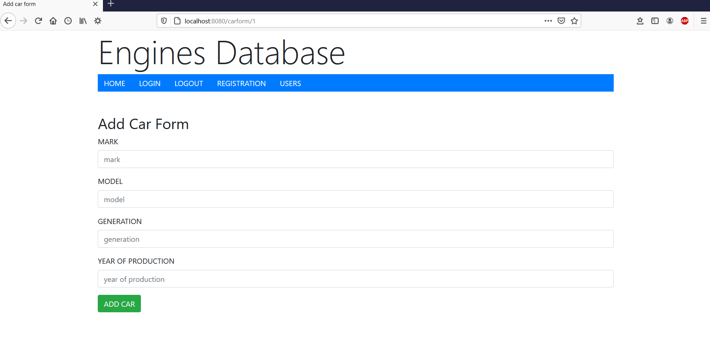
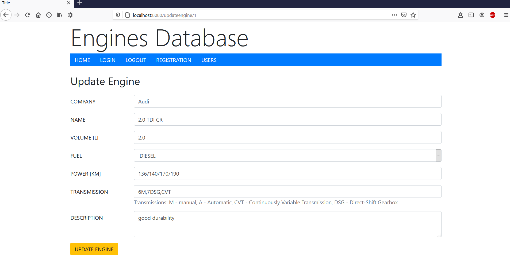
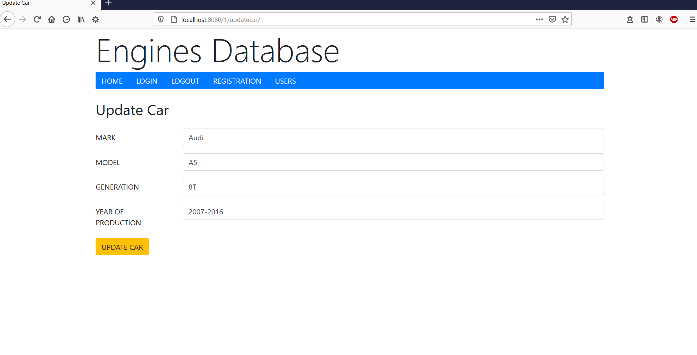
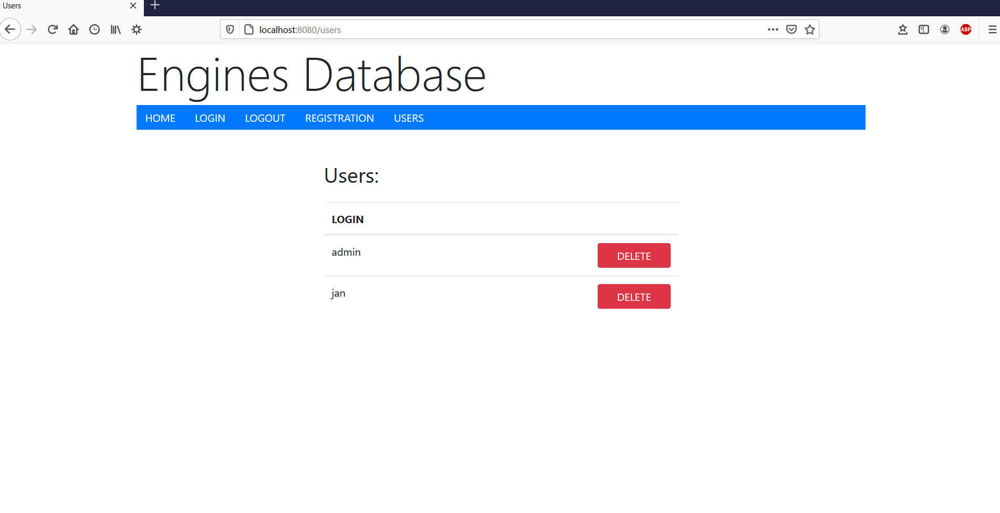

# EnginesApp

In this project I used Spring Security. In application users can add engines and cars which use them. Application is conected with MySql database and frontend is create by thymeleaf 
and bootstrap. Application is secured.

## Table of content
* [General info](#general-info)
* [Technologies](#technologies)
* [Setup](#setup)
* [Application](#application)

## General info

In this application user can create his own engines database. The CRUD methods are implemented (add,delete,update). I used two tables with ManyToMany relation. On main page there is 
a table which displays all engines from database. User can select engine and see which cars use it. To use CRUD methods user has to regiser and login into application. Futhermore 
in application is one admin account. Admin can create own engines database or delete users from users database. 

## Technologies

Project is created with:

* SpringBoot veersion 2.4.2 (Spring Security, Data JPA, Web)
* Thymeleaf
* Bootstrap
* HTML

## Setup

To run this project, download it to your IDE which operates Spring Boot and click run project as Spring Boot App. Open any web browser and go to localhost:8080. In application
there are two default account: 
* admin account:  
login: admin  
password: admin
* user account:   
login: jan  
password: 123

## Application

